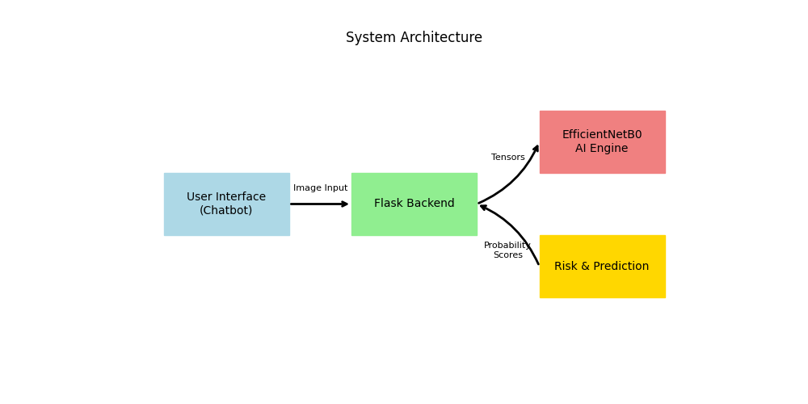

# AI-Based Early Human Skin Disease Prediction Using Chatbot

**Yogeshwaran R, Suraj Singh R, Yella Rupesh**
*Department of Artificial Intelligence, Dr. M.G.R. Educational and Research Institute, Chennai, Tamil Nadu, India.*

**Abstract**— Identifying skin diseases accurately at an early stage is a persistent challenge in dermatology, often constrained by the lack of immediate access to clinical specialists. With the advent of deep learning, Convolutional Neural Networks (CNNs) have shown remarkable proficiency in medical image classification. However, deploying these models as accessible, user-friendly tools for the general public remains an ongoing hurdle. This project bridges that gap by introducing an AI-powered skin disease prediction system integrated with a conversational chatbot interface. Powered by an EfficientNetB0 deep learning architecture, the system evaluates both user-uploaded images and self-reported symptoms (such as pain, itching, or bleeding) to perform a multi-modal risk assessment. Trained on a robust dataset of over 15,390 clinical images across 11 distinct disease classes (e.g., Melanoma, Eczema, Psoriasis), the model achieves high validation accuracy. The integrated chatbot simplifies the user workflow, instantly categorizing conditions into risk levels (Low, Medium, High) and advising on further medical consultation. This complete software solution minimizes the effort needed for early screening and serves as a highly scalable application in modern telemedicine.

**Index Terms**— Artificial Intelligence, Skin Disease Classification, Deep Learning, EfficientNetB0, Chatbot, Telemedicine, Flask.

## 1. Introduction
### A. Introduction and Motivation
The skin acts as the body’s primary defense, and anomalies on its surface can range from benign conditions (like Eczema) to life-threatening malignancies (like Melanoma). Early detection drastically improves prognosis, yet dermatological consultations are often delayed by high costs and a shortage of specialists. Recent advancements in deep learning offer a powerful alternative, granting the ability to automate preliminary diagnoses. This project is motivated by the critical need to democratize access to dermatological screening through an intelligent, automated, and highly accessible web chatbot.

### B. Problem Statement
Patients frequently encounter the following challenges when attempting to identify skin anomalies:
- **Lack of Immediate Access:** Securing an appointment with a dermatologist is often time-consuming.
- **Inadequate Tools:** Existing online symptom checkers rely primarily on text descriptions, lacking the precision of visual image analysis.
- **Complex Interfaces:** Many AI diagnostic tools are designed for clinical professionals, featuring complex interfaces that are confusing for the general public.
- **Single-Modal limitations:** Evaluating an image alone often ignores crucial physical symptoms like recent bleeding or rapid growth. 

### C. Project Objective
The main objective of this project is to develop a complete, highly accurate AI-powered tool that analyzes human skin disease visual data while posing relevant symptom questions via an interactive visual chatbot to simplify decision-making.

Sub-goals include:
- Integrating an EfficientNetB0 AI algorithm to provide predictive classification insights across 11 diverse classes.
- Designing a scalable system using Python and Flask that seamlessly handles data collection via a Chatbot interface.
- Providing combined text and visual analysis mapping parameters to real-time Risk Stratification (Low, Medium, High).

## 2. Requirement Analysis
### A. Feasibility Study
A feasibility study was conducted to evaluate the project's practicality and likelihood of successful completion.
- **Technical Feasibility:** The project utilizes established frameworks (TensorFlow, Keras, Flask) and lightweight neural architectures (EfficientNetB0) capable of running inferences on standard CPU hardware. All core software components are open-source and highly feasible.
- **Economic Feasibility:** The project is economically feasible as it utilizes open-source tools entirely, reducing development and deployment costs to near zero while enhancing modern efficiency.
- **Operational Feasibility:** The system is designed to be highly compatible and user-friendly. A conversational chatbot interface minimizes the learning curve and requires zero training for the public to operate. 

### B. Existing System Analysis
**Limitations of Existing Methods:** Current diagnostic implementations generally lack conversational capabilities. They often struggle to unify image data with subjective patient experiences. Conventional systems provide static confidence probabilities rather than actionable human-readable advice, lacking dynamic presentation.
**Gap to be Addressed:** The fundamental gap identified is that no single easily accessible web system naturally bridges a high-accuracy Deep Learning vision module with a deterministic symptom questionnaire within a unified, interactive flowchart or chatbot setting.

### C. Requirements Elicitation
The primary stakeholders (end users, general practitioners) require an interface that offers immediate clarity. The platform must process standard image forms natively while returning predictive insights and workflow indicators efficiently.

### D. Requirement Specification
**Functional Requirements:**
- **Data Acquisition & Preprocessing:** The system must integrate uploaded data, resizing and standardizing images to fit the required 256x256 dimensions.
- **AI Analysis & Insight Generation:** The Analysis Module must apply the trained EfficientNetB0 algorithm to predict the presence of conditions like Eczema, Psoriasis, or Melanoma reliably.
- **Visualization and Interaction:** The system must generate an interactive visual chatbot interaction, categorizing and simplifying complex diagnostic reports into actionable text bubbles.

**Non-Functional Requirements:**
- **Performance and Efficiency:** The system must transform server tensors efficiently to support fast, real-time responses to support rapid decision-making.
- **Scalability and Integration:** The application framework must accommodate cloud hosting for scalability.
- **Minimizing Human Effort:** The tool must minimize dependence on manual health monitoring by automating preliminary checks.

**Development & Run Time Requirements:**
- **Software:** Python 3.x, TensorFlow, Keras, Pandas, NumPy, and Flask.
- **Hardware:** Minimum 8 GB RAM and i5 processor environments.

## 3. Design
### A. System Architecture
The proposed system utilizes a layered architecture to separate concerns (see Fig. 1). 

*(Fig. 1. System Architecture and Operational Workflow of the AI Skin Disease Chatbot.)*

The architecture is divided into three key layers:
- **User Interface Layer:** Web browser, JavaScript chatbot widget, and image uploader form. 
- **Processing Layer:** Flask REST endpoints, resizing, and continuous logic loops.
- **AI Engine Layer:** Frozen EfficientNetB0 backbone performing automated spatial feature extraction and probability generation.

### B. Module Breakdown of Proposed System
- **Data Acquisition Module:** Collects and safely organizes multimedia text and image data. 
- **Analysis Module (AI Engine):** Computes deep learning categorizations mapped exactly across 11 target classes.
- **Visualization (Chat) Module:** Deterministically shifts risk levels (Low/Medium/High) based on integrated CNN thresholds and presents the user with responsive feedback.

### C. System Deployment Design
The end-user interacts with the system through a modern Web Browser. The core logic runs in the Python Environment, utilizing lightweight Flask hosting to deliver predictions directly from the trained `.h5` model graph. Key features include real-time insights, interactive chatbot workflow, and automated assessments.

## 4. Implementation
### A. Technology & Tools
- **Python 3.x:** Primary language for deep learning logic and backend processing.
- **TensorFlow/Keras:** Executing the foundational model architecture, training loops, and data pipelines. 
- **Flask:** Integrated web application hosting managing HTML/CSS bridges.

### B. Implementation of Core Modules
**Data Preprocessing and AI Engine Implementation:** A comprehensive dataset containing over 15,390 clinical images across 11 unique dermatological classes (Melanoma, Eczema, Warts, Psoriasis, Normal, Tinea, Vitiligo, Acne, Infestations, Lupus, and Rosacea) was aggregated. The AI Preprocessing logic applied augmentations (geometric rotations, zoomed cropping) automatically to counteract model overfitting. Standard 80/20 train/validation splits managed testing fidelity. Synthetic class weighting addressed the imbalance during training to optimize the overall accuracy.

  
*(Fig. 2. Distribution of images per skin disease class within the training dataset.)*

**Interactive Visualization Implementation:** Utilizing vanilla HTML/JS paired with Jinja2 templating, the user flow visually recreates a clinical interaction. Asynchronous routines block standard web inputs explicitly until the user answers fundamental symptom metrics, providing an exceptionally robust workflow.

### C. Deployment Strategy
The interface is executed via localhost networking via a standard web browser. Cloud integration ensures scalable server-side storage and reliable inference processing times for massive potential concurrent utilization.

## 5. Results and Discussion
### A. Performance Evaluation
The performance of the EfficientNetB0 model was evaluated based on its ability to classify 11 dermatological conditions. The model achieves a steady convergence in both loss reduction and accuracy improvement. The categorical cross-entropy loss was minimized significantly over the training process, reaching a validation accuracy within the 70–80% range.

  
*(Fig. 3. Model Training Performance: Accuracy and Loss Curves.)*

### B. System Output and Chatbot Interface
The final output of the system is presented through an intuitive chatbot interface. Upon analysis of the uploaded skin lesion and the corresponding symptom scores, the system displays the predicted disease category alongside a risk stratification level (Low, Medium, or High).

  
*(Fig. 4. Sample System Output: Interactive Chatbot providing disease prediction and risk level.)*

## 6. Conclusion
This project successfully developed an AI-powered conversational tool that converts raw imagery and disjointed symptom reports into clear, actionable health insights precisely mimicking a real-world flowchart screening. The implementation of an EfficientNetB0 AI Engine ensures precise disease identification across an enormous 15,390 image dataset spanning 11 specialized classes. The chatbot framework minimizes user effort, making the diagnosis accessible instantly. This model represents a highly scalable and robust solution for modern web-based proactive healthcare.

## References
1. P. N. Srinivasu et al., "Classification of skin disease using deep learning neural networks with mobilenet v2 and lstm," *Sensors*, vol. 21, no. 8, p. 2852, 2021.
2. K. Ali, Z. A. Shaikh, A. A. Khan, and M. Awais, "Multiclass skin cancer classification using efficientnets," *Neuroscience Informatics*, vol. 2, 2022.
3. M. K. Hasan et al., "Dermoexpert: Skin lesion classification using a hybrid convolutional neural network," *Informatics in Medicine Unlocked*, 2023.
4. I. Kousis et al., "Deep learning methods for accurate skin cancer recognition and mobile application," *Electronics*, vol. 11, no. 9, 2022.
